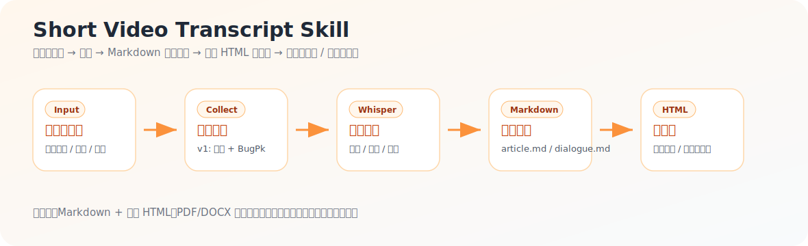

# Short Video Transcript Skill

一个面向 AI Agent 的短视频采集、转写、Markdown 内容沉淀和公众号图文草稿工作流。它把短视频链接或主页内容整理成可沉淀、可检索、可发布的 Markdown 和原生 HTML，适合 Codex、Trae、WorkBuddy、OpenClaw 等 Agent 工具调用，也可以作为普通 Python CLI 使用。

当前 v1 已支持国内抖音，解析来源默认使用 BugPk API。项目名和入口已为快手、小红书、B 站、TikTok 等平台预留扩展位，但这些平台尚未实现，文档不会假装已经支持。



先看效果：[`图文说明 / Showcase`](references/showcase.md) | [`大冰案例`](references/example-dabing.md) | [`公众号配置`](references/wechat-setup.md)

## 功能

- 输入短视频分享文本、短链、完整链接；v1 已支持抖音视频链接。
- 输入创作者主页链接；v1 已支持抖音博主主页，默认最多处理 10 条视频，降低风控风险。
- 提供通用入口 `scripts/short_video_collect.py`，`--platform auto` 会自动分发到已实现平台。
- 下载并保留视频和音频。
- 当音频直链为空时，自动用 FFmpeg 从视频抽取音频。
- 可选从视频中均匀抽取截图，用于公众号图文稿。
- 使用 OpenAI Whisper 生成转写，默认模型为 `medium`。
- 默认恢复基础中文标点，同时保留 Whisper 未加标点的原始文本。
- 默认生成机器文案底稿：`copy.txt` 只有正文，`copy.md` 带标题和来源。
- 在 Codex/AI agent 中使用时，agent 会再生成 `copy.zh.txt` / `copy.zh.md`，由 AI 按中文语感修正标点和自然段；短视频默认不逐句换行。
- Markdown 和原生 HTML 是一等产物：`article.md` / `dialogue.md` 用作内容母版，暖光卡片 HTML 用作公众号预览、复制和草稿上传。
- 可选生成公众号排版稿：`wechat.md` 和秋日暖光卡片风 `wechat-warm-card.html`。
- 支持 agent 工作流生成公众号图文文章：从转写分段中判断内容节点，抽取关键帧，写成 `article.md` / `dialogue.md`，再渲染为暖光卡片 HTML。
- 支持用 Pandoc/Typst/LibreOffice 等成熟工具把本地 Markdown 图文稿派生导出为 PDF 或 DOCX，不默认依赖 Chrome/Edge，适合离线归档；PDF/DOCX 不替代 Markdown/HTML 主流程。
- 支持把本地图文 HTML 上传为微信公众号草稿：自动上传正文截图、封面图，并生成草稿结果 JSON；默认只建草稿，不自动发布。
- 后续知识库笔记和公众号改写作为下游步骤，不混入文案提取层。
- 纯命令行使用时，可选调用 OpenAI 做“忠实清洗”：进一步修复标点、轻校错字、分段和整理成 Markdown 笔记。
- 输出 `manifest.json`、`metadata.json`、`transcript.md`，适合本地知识库归档。

## 安装

需要 Python 3.10+ 和 FFmpeg。

```powershell
cd short-video-transcript-skill
pip install -r scripts/requirements.txt
ffmpeg -version
```

如果 `ffmpeg -version` 不可用，请先安装 FFmpeg，并把 `ffmpeg.exe` 所在目录加入系统 `PATH`。

Markdown/HTML 主流程只需要 Python 和 FFmpeg。PDF/DOCX 导出是可选派生能力，推荐安装 [Pandoc](https://pandoc.org/)；需要 PDF 时再安装 [Typst](https://typst.app/) 或 [LibreOffice](https://www.libreoffice.org/)。脚本会按 `pandoc-typst`、`pandoc-soffice`、`pandoc-docx` 的顺序自动选择，不要求用户电脑有 Chrome 或 Edge。

## 使用

推荐先使用通用入口干跑，确认链接能被识别并分发到已实现平台：

```powershell
python scripts/short_video_collect.py collect "3.30 复制打开抖音，看看【钱江晚报的作品】近日，萧山城河街一家复古老茶馆悄然走红。该茶馆于6... https://v.douyin.com/zhw_hrZ0E-c/ :3pm w@f.OX 04/21 PXm:/ 。" --platform auto --dry-run
```

真实采集单条视频：

```powershell
python scripts/short_video_collect.py collect "https://v.douyin.com/zhw_hrZ0E-c/" --platform auto --out output --model medium
```

抖音 v1 也保留兼容入口：

```powershell
python scripts/douyin_collect.py collect "3.30 复制打开抖音，看看【钱江晚报的作品】近日，萧山城河街一家复古老茶馆悄然走红。该茶馆于6... https://v.douyin.com/zhw_hrZ0E-c/ :3pm w@f.OX 04/21 PXm:/ 。" --dry-run
```

正式高精度采集建议：

```powershell
python scripts/short_video_collect.py collect "<短视频链接>" --platform auto --out output --model large-v3 --overwrite
```

如果机器跑 `large-v3` 太慢，可以用 `large-v3-turbo`：

```powershell
python scripts/short_video_collect.py collect "<短视频链接>" --platform auto --out output --model large-v3-turbo --overwrite
```

采集博主主页，默认 10 条：

```powershell
python scripts/short_video_collect.py collect "https://www.douyin.com/user/xxxx" --platform auto --kind profile --out output --model medium
```

快速验证可用 `tiny` 或 `base` 模型：

```powershell
python scripts/short_video_collect.py collect "<短视频链接>" --platform auto --model tiny --limit 1
```

开启 AI 清洗版：

```powershell
$env:OPENAI_API_KEY="你的 API Key"
python scripts/short_video_collect.py collect "<短视频链接>" --platform auto --model medium --ai-polish --ai-model gpt-5.5
```

如果是在 Codex 里调用这个 skill，第一步先生成 `copy.txt` 机器底稿，然后由 agent 读取 `metadata.json` / `copy.txt` 生成 `copy.zh.txt` 中文标点版。`--ai-polish` 主要给纯命令行用户使用，不是默认路径。

AI 清洗只做学习笔记整理：修复标点、轻校错字、分段和加小标题。无论由 agent 处理还是 CLI 处理，都应保留来源、不伪装原创、不编造视频里没有的信息。

生成公众号排版稿：

```powershell
python scripts/short_video_collect.py collect "<短视频链接>" --platform auto --out output --model medium --wechat-template warm-card --frame-count 5
```

推荐使用 `warm-card`，也可以写成兼容别名 `autumn-warm`。它是“暖光卡片”风格：暖白底、橙色强调、卡片布局、浅纹理和轻阴影。它会额外输出：

- `wechat.md`：公众号友好的 Markdown 结构稿。
- `wechat-warm-card.html`：纯内联样式 HTML，不使用 `<style>` 和 `class`，适合复制到公众号后台前预览。
- `media/frames/frame_01.jpg` 等视频截图；传 `--frame-count 0` 则不抽帧。

生成公众号图文文章工作流：

```powershell
# 1. 先采集、下载、转写
python scripts/short_video_collect.py collect "<短视频分享文本或链接>" --platform auto --out output --model medium --limit 1

# 2. agent 读取 metadata.json / transcript_segments 后，选择内容节点抽关键帧
python scripts/douyin_collect.py extract-frames "output/<author>/<aweme_id>" --times 00:00:08 00:05:35 00:09:35 00:13:20 --prefix article --contact-sheet

# 3. agent 写好 article.md 或 dialogue.md 后，渲染暖光卡片 HTML
python scripts/douyin_collect.py render-article "output/<author>/<aweme_id>" --input article.md --html article-warm-card.html
```

如果是连麦、访谈、直播切片这类多说话人视频，推荐使用 `dialogue.md` / `dialogue-warm-card.html`；如果是单人口播，推荐使用 `article.md` / `article-warm-card.html`。

导出本地 PDF：

```powershell
# 自动选择 dialogue.md / article.md / copy.zh.md 等输入，生成同名 PDF
python scripts/export_pdf.py "output/<author>/<aweme_id>"

# 指定输入和输出
python scripts/export_pdf.py "output/<author>/<aweme_id>" --input dialogue.md --pdf dialogue.pdf

# 保留中间 DOCX，便于二次编辑
python scripts/export_pdf.py "output/<author>/<aweme_id>" --input dialogue.md --keep-docx

# 只有 Pandoc、没有 PDF 引擎时，先导出 DOCX
python scripts/export_pdf.py "output/<author>/<aweme_id>" --provider pandoc-docx --docx dialogue.docx
```

PDF 导出是本地知识库的派生能力，不需要公众号配置。内容母版仍然是 `dialogue.md` / `article.md`，视觉母版仍然是 `dialogue-warm-card.html` / `article-warm-card.html`；PDF/DOCX 只用于离线阅读、归档或发给别人预览。默认 provider 顺序是 `pandoc-typst` > `pandoc-soffice` > `pandoc-docx`；浏览器打印只适合作为用户显式要求时的人工备用方案，不作为默认链路。

创建微信公众号草稿是可选增强能力：

```powershell
# 先检查配置是否齐全，不输出密钥
python scripts/wechat_draft.py check-config

# 也可以显式复用外部配置文件
python scripts/wechat_draft.py --env-file "C:\path\to\.env" check-config

# 上传前先干跑，确认 HTML、封面、图片引用都没问题
python scripts/wechat_draft.py create-draft "output/<author>/<aweme_id>" --html dialogue-warm-card.html --cover media/frames/dialogue_01.jpg --dry-run

# 创建草稿，默认不正式发布
python scripts/wechat_draft.py create-draft "output/<author>/<aweme_id>" --html dialogue-warm-card.html --cover media/frames/dialogue_01.jpg

# 修改已有草稿，不额外新建
python scripts/wechat_draft.py create-draft "output/<author>/<aweme_id>" --html dialogue-warm-card.html --cover media/frames/dialogue_01.jpg --draft-media-id "<media_id>"
```

公众号配置读取顺序：当前环境变量、`.shiyi-wechat/.env`、`config/shiyi-wechat/.env`、`~/.shiyi-wechat/.env`。常用字段：

```text
WECHAT_MODE=proxy
WECHAT_API_BASE=https://your-proxy.example.com
WECHAT_APP_ID=...
WECHAT_APP_SECRET=...
WECHAT_DEFAULT_AUTHOR=...
```

可以参考 `config/shiyi-wechat/.env.example` 创建本地 `.env`。真实 `.env` 已被 `.gitignore` 忽略，不要提交密钥。

如果直接连微信官方接口，可用 `WECHAT_MODE=direct`；如果你的公众号 IP 白名单限制比较严格，推荐使用 `proxy` 模式接入已有代理服务。默认不设置公众号“阅读原文”，只有显式传 `--content-source-url` 才写入；只有明确传 `--publish` 时才会提交发布，否则只创建/更新草稿，方便人工复核。

公众号公开稿不要包含工作流信息：不要把“这不是逐字稿”、原视频链接、音频时长、说话人清单、ASR 校对说明、候选标题列表、切片金句清单写进正文。需要留痕的信息放到 `metadata.json`、`copy.zh.md` 或私有备注文件里。公开稿可以保留一个自然导语，并在结尾用 AI 写一段忠实总结，把有力量的句子自然吸收进去。

更完整的公众号环境说明见 `references/wechat-setup.md`。

## 示例效果

我们用一条“大冰/冰言冰语”的抖音视频跑通过完整链路：采集视频、转写音频、按对话整理 `dialogue.md`、抽取关键帧、渲染暖光卡片 HTML，并同步成微信公众号草稿。

示例标题：

```text
一一大哥的故事：德高为兄
```

最终产物形态：

- `dialogue.md`：适合继续编辑和沉淀的内容母版。
- `dialogue-warm-card.html`：适合公众号预览、复制和草稿上传的原生 HTML。
- `media/frames/dialogue_*.jpg`：从视频抽取的关键画面。
- `wechat-draft-preview.html`：提交给公众号草稿接口前的本地预览正文。
- `wechat-draft-result.json`：草稿创建/更新结果，不包含密钥。

更完整的脱敏案例说明见 `references/example-dabing.md`。注意不要把微信公众号后台编辑链接放进公开仓库；这类链接通常包含 `token`，只适合自己本机临时打开。

## 输出

默认写入：

```text
output/
  manifest.json
  <author>/
    <aweme_id>/
      metadata.json
      transcript.md
      copy.md
      copy.txt
      copy.zh.md
      copy.zh.txt
      wechat.md
      wechat-warm-card.html
      article.md
      article-warm-card.html
      dialogue.md
      dialogue-warm-card.html
      dialogue.pdf
      dialogue.docx
      wechat-draft-preview.html
      wechat-draft-result.json
      media/
        video.mp4
        audio.mp3
        frames/
          frame_01.jpg
          frame_02.jpg
          article_01.jpg
          dialogue_01.jpg
```

详细字段见 `references/output-format.md`。

## 开发验证

```powershell
python -m py_compile scripts/short_video_collect.py
python -m py_compile scripts/douyin_collect.py
python -m py_compile scripts/wechat_draft.py
python -m py_compile scripts/export_pdf.py
python -m unittest discover -s tests
```

## 说明

- `--dry-run` 只解析元数据，不下载、不转写、不写输出文件。
- `short_video_collect.py` 是通用入口；v1 的 `auto` 只会分发到 `douyin`，其他平台会明确提示暂未实现。
- `--overwrite` 会重新下载媒体并重新转写。
- 已存在且非空的媒体文件默认跳过，已有转写默认复用。
- `metadata.json` 中的 `raw_transcript_text` 是 Whisper 原始文本，`transcript_text` 是恢复标点后的文本。
- `copy.txt` 是机器文案正文。
- `copy.md` 是带标题和来源信息的机器文案归档版。
- `copy.zh.txt` 是 AI 按中文标点校对后的正文，适合后续接公众号工作流；短视频通常是一段自然正文，正文里不要出现 `[疑似：...]` 这类批注。
- `copy.zh.md` 是带标题和来源信息的中文标点归档版。
- `wechat.md` 是公众号阅读结构稿；默认不生成，传 `--wechat-template plain|warm-card|autumn-warm` 才会生成。
- `wechat-warm-card.html` 是秋日暖光卡片风排版稿，适合作为备选公众号视觉模板。
- `--frame-count <N>` 会用 FFmpeg 从视频中均匀抽取 N 张截图，并在 `wechat.md` / `wechat-warm-card.html` 中引用。
- `extract-frames` 会按 agent 选择的时间点抽取关键帧，更适合最终公众号图文文章。
- `render-article` 会把 `article.md` / `dialogue.md` 渲染成暖光卡片 HTML，支持 `#`、`##`、`###`、引用、列表和图片。
- `export_pdf.py` 会用 Pandoc/Typst/LibreOffice 等成熟工具把本地 Markdown 图文稿派生导出为 PDF 或 DOCX；默认自动选择 `dialogue.md`、`article.md` 或 `copy.zh.md`，不改变 Markdown/HTML 主产物。
- `wechat_draft.py create-draft` 会把暖光卡片 HTML 中的本地图片上传到微信公众号，并替换成微信图片 URL 后创建草稿；传 `--draft-media-id` 时更新已有草稿。
- `wechat-draft-preview.html` 是最终提交给公众号草稿接口的正文 HTML；`wechat-draft-result.json` 记录草稿 `media_id`、图片上传映射和是否发布，不包含密钥。
- 如果出现“半块钱”这类明显不合语义的 ASR 结果，优先用 `large-v3`/`large-v3-turbo` 重跑；agent 可在上下文充分时修正文案，并在 `copy.zh.md` 记录校对依据。
- `--ai-polish` 会额外生成 `ai_polished_text`，并在 Markdown 中写入 `AI 清洗版`。
- Codex/AI agent 使用时，建议额外生成 `notes.md`，作为最终知识库阅读版。
- BugPk API 属于第三方服务，可用性和返回字段可能变化。
