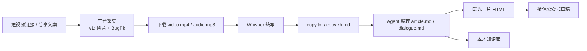

# 图文说明：从短视频到公众号图文稿

这个页面给第一次打开仓库的人看：不用先读源码，先理解这个 skill 能把什么输入变成什么产物。


## 一句话

把短视频链接交给 AI Agent，自动采集视频和音频，转成可编辑的 Markdown，再生成适合公众号预览、复制和草稿上传的原生 HTML。

## 适合谁

| 场景 | 产物 |
| --- | --- |
| 想沉淀面试、知识、直播切片 | `copy.zh.md` / `notes.md` / `metadata.json` |
| 想整理公众号文章 | `article.md` 或 `dialogue.md` |
| 想做图文版公众号 | `article-warm-card.html` 或 `dialogue-warm-card.html` |
| 想直接进公众号后台复核 | `wechat-draft-preview.html` / `wechat-draft-result.json` |
| 想离线归档 | 可选 `PDF` / `DOCX` |

## 核心链路



## 示例：大冰视频整理

我们用“大冰/冰言冰语”的一条视频跑通过完整链路，最终整理成公众号图文稿。

示例标题：

```text
一一大哥的故事：德高为兄
```

一句话重点：

```text
一个孩子在该站出来的时候，替这个世界守住了常识。
```

最终不是只得到一份逐字稿，而是得到一组可以继续使用的文件：

- `dialogue.md`：内容母版，后续编辑和版本管理都从这里开始。
- `dialogue-warm-card.html`：公众号视觉母版，暖光卡片风。
- `media/frames/dialogue_*.jpg`：从视频里抽出的关键帧。
- `wechat-draft-preview.html`：提交到公众号前的本地预览。
- `wechat-draft-result.json`：草稿接口结果，不包含密钥。

完整脱敏案例见 [`example-dabing.md`](example-dabing.md)。

## 为什么强调 Markdown + 原生 HTML

Markdown 是内容母版，适合 Agent 修改、知识库沉淀和 Git 管理。原生 HTML 是公众号视觉母版，适合预览、复制和上传草稿。PDF/DOCX 只是派生导出，不反过来主导排版。

## 可选：用 image2 补充视觉图

默认优先使用视频真实抽帧，因为它最忠实于来源。必要时可以把 image2 / 图像生成能力接入工作流，用来生成这些辅助视觉：

- 公众号封面图。
- 文章分隔图、栏目头图、流程示意图。
- 没有合适视频画面时的概念插图。

使用规则：

- 必须和正文主题一致，不生成视频里没有发生过的事实画面。
- 不能把 AI 生成图伪装成视频截图。
- 如果用于公开发布，建议在私有备注或发布记录中标记为 AI 生成辅助图。
- 有真实视频关键帧时，优先使用 `media/frames/*.jpg`。

## 公众号参数

公众号草稿是可选能力。只想本地沉淀资料，不需要配置公众号。

需要上传草稿时准备：

```text
WECHAT_MODE=proxy
WECHAT_API_BASE=https://your-proxy.example.com
WECHAT_APP_ID=...
WECHAT_APP_SECRET=...
WECHAT_DEFAULT_AUTHOR=...
```

真实 `.env` 不要提交。公开仓库只保留 `config/shiyi-wechat/.env.example`。

更多配置见 [`wechat-setup.md`](wechat-setup.md)。

## 安全边界

- 不公开微信公众号后台编辑链接，这类链接通常带 `token`。
- 不提交真实 AppSecret、access_token、cookie、代理密钥或 OpenAI key。
- 不把原视频链接、ASR 校对说明、候选标题列表写进公众号正文。
- v1 只真实支持国内抖音；快手、小红书等平台是后续扩展目标。
